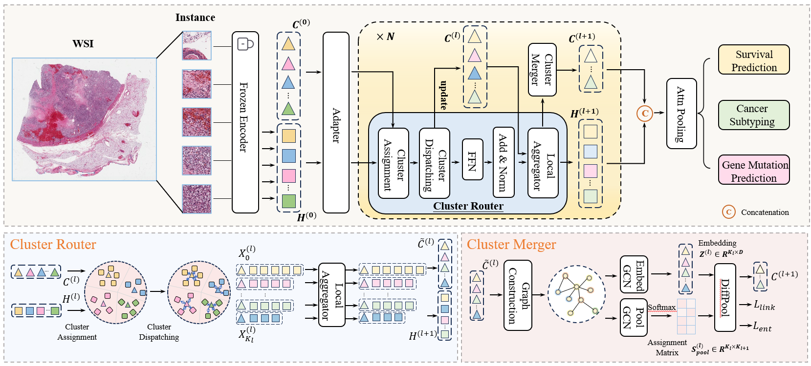

# Dispersion-to-Consolidation: Consolidating Dispersed Semantics via Context-Aware Clustering for Whole Slide Images Analysis

This repository contains the official implementation of the paper: **Dispersion-to-Consolidation: Consolidating Dispersed Semantics via Context-Aware Clustering for Whole Slide Images Analysis**.



## 1\. Requirements

Our code has been tested on the following environment:

  - **OS:** Ubuntu 22.04
  - **GPU:** NVIDIA A100 (CUDA 11.6)
  - **Python:** 3.9.0

## 2\. Installation

Follow these steps to set up the environment and install the required packages.

**Step 1: Create and activate the conda environment**

We recommend using Conda to manage the dependencies.

```bash
# Create a new conda environment named "DisCo" with Python 3.9
conda create -n DisCo python=3.9.0

# Activate the newly created environment
conda activate DisCo
```

**Step 2: Install PyTorch with CUDA support**

Install the specific PyTorch version compatible with CUDA 11.6.

```bash
pip3 install torch==1.13.1+cu116 torchvision==0.14.1+cu116 -f https://download.pytorch.org/whl/cu116/torch_stable.html
```

**Step 3: Install PyTorch Geometric and related packages**

Install the required libraries for graph-based deep learning.

```bash
pip install torch-scatter==2.1.1 -f https://pytorch-geometric.com/whl/torch-1.13.1+cu116.html
pip install torch-sparse==0.6.17 -f https://pytorch-geometric.com/whl/torch-1.13.1+cu116.html
pip install torch-cluster==1.6.1 -f https://pytorch-geometric.com/whl/torch-1.13.1+cu116.html
pip install torch-spline-conv==1.2.2 -f https://pytorch-geometric.com/whl/torch-1.13.1+cu116.html
pip install torch-geometric==2.5.2
```

**Step 4: Install remaining dependencies**

Install all other necessary packages from the `requirements.txt` file.

```bash
pip install -r requirements_DisCo.txt
```

## 3\. Usage

The pipeline consists of three main stages: Feature Generation, obtaining Cluster Representations, and Feature Aggregation for downstream tasks.

### 3.1. Feature Generation

**WSI & Label Processing**

To begin, you need to process your Whole Slide Images (WSIs) into feature vectors.

  - For embedding WSIs into patch features, please follow the pipeline outlined in the **[CLAM](https://github.com/mahmoodlab/CLAM)** repository.
  - For processing labels related to survival analysis (follow-up time and censorship), please refer to the methodologies described in **[PatchGCN](https://github.com/mahmoodlab/Patch-GCN)**.

The output of this stage should be a directory of `.pt` files, where each file contains the feature vectors for a single WSI.

### 3.2. Obtain Cluster Representations

After generating patch-level features, use context-aware clustering to generate representative features for each WSI.

Run the `run_clustering.py` script with the following command:

```bash
python run_clustering.py \
    --dataset_name BLCA \
    --n_clusters 64 \
    --input_dir /path/to/your/input_pt_files \
    --output_dir /path/to/your/output_directory \
    --gpu
```

**Arguments:**

  - `--dataset_name`: Name of the dataset (e.g., BRCA).
  - `--n_clusters`: The number of clusters to form.
  - `--input_dir`: Path to the directory containing the patch feature `.pt` files from the previous step.
  - `--output_dir`: Path to the directory where the clustered feature representations will be saved.
  - `--gpu`: Flag to enable GPU usage.

### 3.3. Feature Aggregation for Downstream Tasks

Finally, use the generated cluster representations to train models for classification or survival analysis.

**For Classification tasks:**

```bash
bash script/run_cls.sh
```

**For Survival Analysis tasks:**

```bash
bash script/run_surv.sh
```

*(Please ensure the shell scripts `run_cls.sh` and `run_surv.sh` are configured with the correct paths to your data and desired model parameters.)*

## 4\. Citation

If you find our work and this repository helpful in your research, we would appreciate it if you could cite our paper. Please use the following BibTeX entry.

```bibtex
@inproceedings{li2025mico,
  title={MiCo: Multiple Instance Learning with Context-Aware Clustering for Whole Slide Image Analysis},
  author={Junjian Li, Jin Liu, Hulin Kuang, Hailin Yue, Mengshen He, and Jianxin
Wang},
  booktitle={International Conference on Medical Image Computing and Computer-Assisted Intervention},
  year={2025},
  organization={Springer}
}
```
